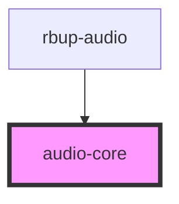

# audio-core

<!-- Auto Generated Below -->

## Properties

| Property            | Attribute | Description | Type                | Default     |
| ------------------- | --------- | ----------- | ------------------- | ----------- |
| `playerCoordinator` | --        |             | `PlayerCoordinator` | `undefined` |

## Methods

### `play() => Promise<void>`

#### Returns

Type: `Promise<void>`

### `stop() => Promise<void>`

#### Returns

Type: `Promise<void>`

## Dependencies

### Used by

 - [rbup-audio](../rbup-audio)

### Graph

----------------------------------------------

*Built with [StencilJS](https://stenciljs.com/)*
