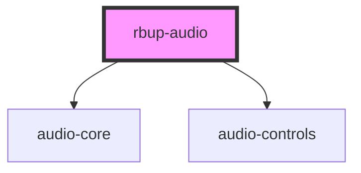

# rbup-audio

<!-- Auto Generated Below -->

## Properties

| Property     | Attribute    | Description | Type      | Default     |
| ------------ | ------------ | ----------- | --------- | ----------- |
| `chromeless` | `chromeless` |             | `boolean` | `undefined` |
| `src`        | `src`        |             | `string`  | `undefined` |

## Methods

### `play() => Promise<void>`

#### Returns

Type: `Promise<void>`

### `setup(options: PlayerOptions) => Promise<void>`

#### Returns

Type: `Promise<void>`

### `stop() => Promise<void>`

#### Returns

Type: `Promise<void>`

## Dependencies

### Depends on

- [audio-core](../audio-core)
- [audio-controls](../audio-controls)

### Graph

----------------------------------------------

*Built with [StencilJS](https://stenciljs.com/)*
